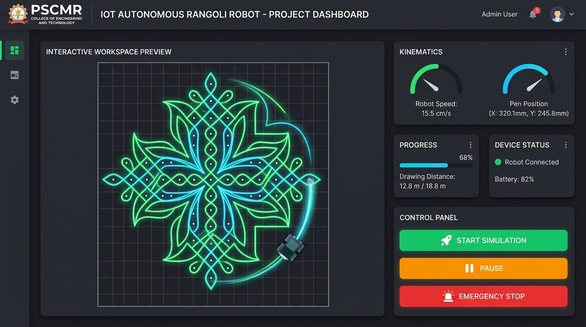
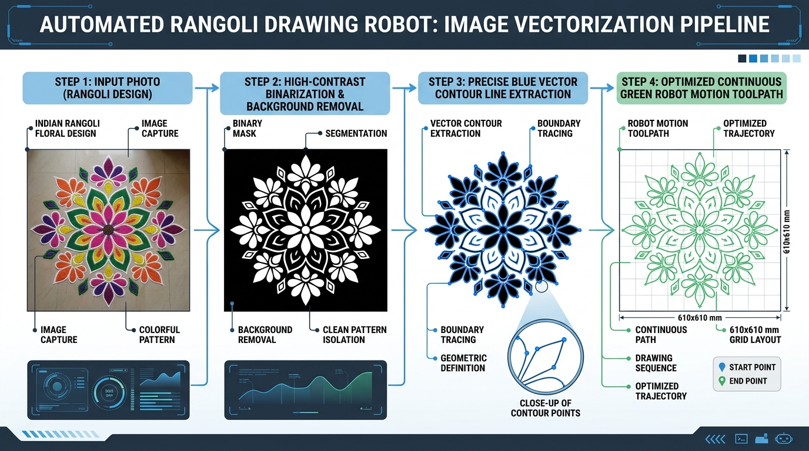
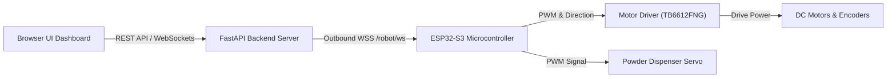
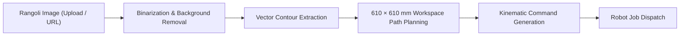

# 🤖 IoT Based Autonomous Rangoli Drawing Robot

[](https://www.python.org/)
[](https://fastapi.tiangolo.com/)
[](https://platformio.org/)
[](LICENSE)
[](#-project-status)
[](#-project-status)

> **PSCMR College of Engineering and Technology**  
> *Department of Computer Science & Engineering (IoT)*  
> **IoT Final Year B.Tech Project — TEAM NO. 12**  
> **Workspace Dimension**: $610 \times 610\text{ mm}$ ($2 \times 2\text{ ft}$)

---

## 📊 Project Status

| Component Layer | Implementation Status | Verification Method |
| :--- | :---: | :--- |
| **Web Dashboard UI** | 🟢 **Software Ready** | Verified across desktop browsers (DEMO & REAL modes) |
| **FastAPI REST & WSS Backend** | 🟢 **Software Ready** | Tested via PyUnit & Uvicorn ASGI server |
| **Image Upload & SSRF Importer** | 🟢 **Software Ready** | End-to-end verified with direct public image URLs |
| **Image Processing & Path Generation** | 🟢 **Software Ready** | Tested via 14 contour extraction & polyline solver |
| **DEMO Kinematic Simulator** | 🟢 **Software Ready** | Interactive 2D differential-drive canvas rendering |
| **WSS Robot Protocol & Security** | 🟢 **Software Ready** | Validated using Python ESP32 hardware emulator |
| **ESP32-S3 Microcontroller** | 🟡 **Hardware Pending** | C++ firmware compiled cleanly via PlatformIO |
| **Motor Drivers & Encoders** | 🟡 **Hardware Pending** | Awaiting physical wiring & motor assembly |
| **Powder Dispensing Servo Mechanism** | 🟡 **Hardware Pending** | Awaiting 3D chassis & servo valve installation |

> [!NOTE]
> **Implementation Clarification**: All software layers, vectorization pipelines, WSS backend protocols, and C++ firmware modules are **100% written, compiled, and verified via automated test suites**. Physical REAL robot operation will be validated once the ESP32 hardware components are acquired and wired.

---

## 📸 System Screenshots & Demonstrations

| Web Dashboard ($610 \times 610\text{ mm}$ Workspace) | Automated Vectorization Pipeline |
| :---: | :---: |
|  |  |
| *Real-time vector trajectory rendering & kinematics telemetry* | *Raster image binarization, contour isolation & continuous motion G-Code* |

---

## 🚀 Quick Start

Run the full local simulation server on Windows PowerShell in less than 2 minutes:

```powershell
git clone https://github.com/harshatk07/rangoli-robot.git
cd rangoli_robot
py -3.12 -m venv .venv
.\.venv\Scripts\Activate.ps1
python -m pip install --upgrade pip
pip install -r requirements.txt
Copy-Item .env.example .env
uvicorn app:app --host 127.0.0.1 --port 5000
```

Access the local server endpoints:
- 🖥️ **Web Dashboard**: [http://127.0.0.1:5000](http://127.0.0.1:5000)
- 🏥 **Health Check API**: [http://127.0.0.1:5000/health](http://127.0.0.1:5000/health)

---

## ✨ Key Features

- 🖼️ **Multi-Format Image Importer**: Upload local `JPG`, `PNG`, `WEBP`, or `SVG` files or import direct public web URLs with SSRF protection.
- 🎨 **Adaptive Rangoli Vectorizer**: Converts raster Rangoli artwork into continuous motion polylines using background removal and contour isolation.
- 📐 **$610 \times 610\text{ mm}$ Kinematic Canvas**: Real-time canvas mapped 1:1 to a physical $2 \times 2\text{ ft}$ workspace with adjustable line widths ($2\text{ mm}$, $3\text{ mm}$, $4\text{ mm}$) and path scaling.
- 🟡 **DEMO Simulation Mode**: Complete browser-side kinematic simulation (no physical hardware required).
- 🔴 **REAL Hardware Mode**: Outbound WebSocket (`wss://`) protocol layer connecting Render FastAPI backend to physical ESP32-S3 microcontroller.
- 📶 **Captive Portal Provisioning**: Automated SoftAP (`RangoliRobot-Setup` @ `192.168.4.1`) for browser-based Wi-Fi credential setup and NVS flash storage.
- 🛡️ **Hardware Safety Watchdog**: Automatic powder valve shutoff and motor halt upon WSS signal loss, 15-second heartbeat timeout, or emergency stop trigger.

---

## 🏗️ System Architecture

### Hardware & Software Communication Architecture



### Image Processing & Motion Vector Pipeline



---

## 📂 Repository Structure

```text
rangoli_robot/
├── app.py                      # FastAPI ASGI App, REST APIs, Outbound WSS Manager
├── Procfile                    # Render cloud execution entrypoint
├── render.yaml                 # Render Infrastructure-as-Code manifest
├── requirements.txt            # Python dependencies (FastAPI, OpenCV, Uvicorn)
├── .env.example                # Template for environment variables (local dev)
├── .gitignore                  # Git exclusions (.env, .venv, .pio, *.db)
├── rangoli_robot.db            # Local SQLite database (ignored by git)
├── core/                       # Core Python robotics & CV processing modules
│   ├── __init__.py
│   ├── db.py                   # DB persistence layer & auth token verification
│   ├── image_processing.py     # Image binarization & background isolation
│   ├── vectorizer.py           # Contour extraction & polyline reduction
│   ├── grid_planner.py         # Workspace path optimization (610 x 610 mm)
│   ├── kinematics.py           # Differential drive inverse kinematics solver
│   ├── benchmark_engine.py     # Robotics performance benchmark suite (13 metrics)
│   └── experiment_logger.py    # Experiment logger & thesis report generator
├── firmware/                   # ESP32-S3 C++ Firmware (PlatformIO Project)
│   ├── platformio.ini          # Board configuration & dependencies (ESP32Servo, ArduinoJson)
│   ├── include/                # Modular C++ header definitions
│   │   ├── config.h            # Hardware GPIO pin map & kinematic constants
│   │   ├── config_storage.h    # NVS storage interface (Preferences)
│   │   ├── wifi_manager.h      # Captive Portal AP (192.168.4.1)
│   │   ├── websocket_client.h  # Outbound WSS transport & heartbeats
│   │   ├── powder_controller.h # Servo powder gate valve control
│   │   └── safety_controller.h # Hardware watchdog & emergency cutoff
│   └── src/                    # C++ source code implementations
│       └── main.cpp            # ESP32 setup() and loop() entrypoint
├── templates/                  # Frontend HTML Dashboard
│   └── index.html              # Single-page web dashboard layout
├── static/                     # Static CSS, JS & Media assets
│   ├── style.css               # Production stylesheet (85px compact header system)
│   ├── script.js              # Frontend state manager & canvas simulator
│   └── uploads/                # Uploaded Rangoli image directory & preview media
├── scratch/                    # Development scripts & hardware emulator
│   └── test_robot_emulator.py  # Standalone Python ESP32 WSS hardware emulator
└── tests/                      # Automated unit test suite
    ├── test_pipeline.py        # Image processing & vectorization pipeline tests
    └── test_api_url_security.py# DB auth, SSRF protection & URL import security tests
```

---

## 💻 Software Requirements

- **Operating System**: Windows 10 / 11 (or Linux / macOS)
- **Python**: Python `3.12.x` (64-bit)
- **Git**: `git` version 2.30+
- **C++ Compiler / IDE (Firmware only)**: VS Code with [PlatformIO IDE Extension](https://platformio.org/)

---

## 🛠️ Step-by-Step Windows Installation

### 1. Verify Prerequisites

```powershell
py -3.12 --version
git --version
```

### 2. Clone Repository

```powershell
git clone https://github.com/harshatk07/rangoli-robot.git
cd rangoli_robot
```

### 3. Create & Activate Virtual Environment

```powershell
py -3.12 -m venv .venv
.\.venv\Scripts\Activate.ps1
```

*(If script execution is blocked, run `Set-ExecutionPolicy -ExecutionPolicy RemoteSigned -Scope CurrentUser` once).*

### 4. Upgrade Pip & Install Dependencies

```powershell
python -m pip install --upgrade pip
pip install -r requirements.txt
```

### 5. Create Local `.env` Configuration File

```powershell
Copy-Item .env.example .env
```

---

## 🏃 Run Locally

Start the local server using Uvicorn:

```powershell
uvicorn app:app --host 127.0.0.1 --port 5000
```

Access local endpoints:
- 🖥️ **Web Dashboard**: [http://127.0.0.1:5000](http://127.0.0.1:5000)
- 🏥 **Health Check Endpoint**: [http://127.0.0.1:5000/health](http://127.0.0.1:5000/health)

---

## 🟡 DEMO Mode (Software Simulation)

No physical hardware is required to test or demonstrate software functionality:

1. Open [http://127.0.0.1:5000](http://127.0.0.1:5000) in your browser.
2. The header defaults to **🟡 DEMO ROBOT — Simulation Only**.
3. Upload a Rangoli image (or click **🌐 Use Image URL**).
4. Select drawing scale (Full $610 \times 610\text{ mm}$) and line width ($3\text{ mm}$).
5. Click **🚀 START SIMULATION**.
6. View real-time 2D differential-drive kinematics on the vector canvas.

---

## 🔴 REAL Robot Mode

In REAL mode, control commands flow from the web browser to the ESP32 via outbound WebSockets:

```text
Browser UI  ──(HTTP/WSS)──>  FastAPI Backend  ──(Outbound WSS /robot/ws)──>  ESP32-S3 Microcontroller
```

> [!IMPORTANT]
> **No Inbound LAN Scanning**: The FastAPI server **never** scans your local network or initiates incoming connections to `192.168.x.x`. The ESP32 robot always initiates the secure outbound WebSocket connection to the server.

---

## 🤖 ESP32 Firmware Setup & Provisioning

### 1. Build Firmware with PlatformIO

Open the `firmware/` directory in VS Code with PlatformIO installed:

```powershell
cd firmware
pio run
```

### 2. Hardware Pin Mapping (`firmware/include/config.h`)

All hardware-dependent GPIO pins and parameters are isolated in `firmware/include/config.h`:

```cpp
#define MOTOR_LEFT_PWM_PIN       25    // Left Motor Speed PWM
#define MOTOR_LEFT_IN1_PIN       26    // Left Motor Direction 1
#define MOTOR_LEFT_IN2_PIN       27    // Left Motor Direction 2

#define MOTOR_RIGHT_PWM_PIN      14    // Right Motor Speed PWM
#define MOTOR_RIGHT_IN1_PIN      12    // Right Motor Direction 1
#define MOTOR_RIGHT_IN2_PIN      13    // Right Motor Direction 2

#define POWDER_SERVO_PIN         18    // Powder Valve Servo (GPIO 18)
#define SETUP_BUTTON_PIN         0     // BOOT Button (Hold 5s to reset Wi-Fi)

const float WHEEL_DIAMETER_MM    = 44.0f;  // Wheel Diameter (mm)
const float WHEEL_BASE_MM        = 120.0f; // Distance between wheels (mm)
```

### 3. Flash Firmware to ESP32

Connect your ESP32-S3 board to your PC via USB and run:

```powershell
pio run --target upload
```

### 4. Wi-Fi Provisioning via Captive Portal

1. On first boot (or after holding the BOOT button for 5 seconds), the ESP32 launches a Wi-Fi Access Point named **`RangoliRobot-Setup`**.
2. Connect your phone or laptop Wi-Fi to **`RangoliRobot-Setup`**.
3. Open **`http://192.168.4.1`** in your browser.
4. Enter the required provisioning parameters:
   - **Wi-Fi SSID**
   - **Wi-Fi Password**
   - **Robot ID** (e.g., `BOT-01`)
   - **Backend WSS URL** (e.g., `wss://rangoli-robot.onrender.com/robot/ws` or `ws://192.168.1.100:5000/robot/ws`)
   - **Robot Auth Token** (e.g., `SECRET_KEY_BOT_01`)
5. Click **Save & Connect Robot**. The configuration is saved permanently to ESP32 NVS Flash.

---

## ⚡ Automatic Robot Reconnection

Once Wi-Fi provisioning is completed:
- On every power-on, the robot automatically connects to Wi-Fi.
- It automatically establishes an outbound WebSocket connection to the Render/Local backend.
- It automatically authenticates and appears in the browser dashboard under **🔍 Discover Robots**.
- **VS Code or a USB PC connection is NOT required for normal operation.**

---

## 🔐 Robot Authentication & Security

- **Token Protection**: Authentication tokens reside in ESP32 NVS Flash and server environment variables. Tokens are **never** sent to browser client-side JavaScript.
- **Handshake Validation**: Upon WSS connection, the robot transmits `{ "type": "robot_auth", "robot_id": "BOT-01", "token": "..." }`. The backend validates credentials via `verify_robot_auth_db`. Unauthenticated connections are closed (`code=4001`).

---

## 📡 Robot Discovery

- Click **🔍 Discover Robots** in the web dashboard header.
- The browser queries `GET /api/robots`.
- Authenticated ESP32 robots connected via WSS appear with status `READY` and live signal metrics.

---

## 🔌 WSS Architecture & Message Protocols

The backend supports bidirectional WebSocket communication:

| Message Type | Direction | Payload Example | Description |
| :--- | :--- | :--- | :--- |
| `robot_auth` | Robot $\rightarrow$ Server | `{"type":"robot_auth", "robot_id":"BOT-01", "token":"..."}` | Robot authentication frame |
| `auth_response` | Server $\rightarrow$ Robot | `{"type":"auth_response", "status":"accepted"}` | Handshake acceptance |
| `heartbeat` | Robot $\rightarrow$ Server | `{"type":"heartbeat", "robot_id":"BOT-01", "timestamp":...}` | Sent every 15 seconds |
| `start_job` | Server $\rightarrow$ Robot | `{"type":"start_job", "job_id":"JOB-123", "segments":[...]}` | Motion command batch |
| `ack` | Robot $\rightarrow$ Server | `{"type":"ack", "command_id":"CMD-456", "status":"accepted"}` | Instant ACK response |
| `telemetry` | Robot $\rightarrow$ Server | `{"type":"telemetry", "x":305.0, "y":305.0, "progress":45.2}` | 20 Hz pose stream |

---

## ⏱️ Heartbeat, ACK Timeout & Safety Watchdog

- **15-Second Heartbeat**: The ESP32 transmits a heartbeat every 15 seconds. If no frame is received for 35 seconds, the server marks the robot `DISCONNECTED`.
- **5-Second Command ACK Timeout**: When the user clicks Start, Pause, or Resume, the server waits up to 5 seconds for a hardware ACK response (`command_id`). If no ACK arrives, the server returns an `ACK_TIMEOUT` error.
- **Hardware Failsafe Watchdog**: If WSS connection drops during execution, the ESP32 immediately turns off the powder valve servo and halts the motors.

---

## 🧪 Robot Emulator

Test the full WSS backend pipeline without physical hardware using the Python emulator:

1. Start local backend server:
   ```powershell
   uvicorn app:app --host 127.0.0.1 --port 5000
   ```
2. In a second PowerShell terminal, run the emulator:
   ```powershell
   $env:PYTHONUNBUFFERED="1"
   py scratch/test_robot_emulator.py ws://127.0.0.1:5000/robot/ws
   ```
3. The emulator registers `BOT-01` as `CONNECTED` and streams 20 Hz telemetry to the dashboard.

---

## 🧪 Automated Unit Tests

Run the full automated test suite covering image vectorization, kinematics, database security, and SSRF URL protection:

```powershell
py -m unittest discover tests
```

Expected output:
```text
......
----------------------------------------------------------------------
Ran 6 tests in 0.249s

OK
```

---

## 🌐 Production REST API Reference

| Endpoint | Method | Request Body | Description |
| :--- | :---: | :--- | :--- |
| `/health` | `GET` | None | Health check endpoint (Returns `200 OK`) |
| `/api/robots` | `GET` | None | Returns list of online authenticated robots |
| `/api/robots/{id}` | `GET` | None | Returns live telemetry for target robot |
| `/api/robots/{id}/select` | `POST` | `{}` | Sets active target robot ID |
| `/api/upload` | `POST` | Multipart Form Image | Uploads local Rangoli image file |
| `/api/import-url` | `POST` | `{"url": "..."}` | Secure backend image download from URL |
| `/api/process` | `POST` | `{"image_id": "..."}` | Vectorizes image & generates toolpaths |
| `/api/jobs` | `POST` | `{"robot_id": "...", "commands": [...]}` | Creates active job record |
| `/api/jobs/{id}/start` | `POST` | `{}` | Sends WSS `start_job` command (5s ACK) |
| `/api/jobs/{id}/pause` | `POST` | `{}` | Sends WSS `pause` command |
| `/api/jobs/{id}/resume` | `POST` | `{}` | Sends WSS `resume` command |
| `/api/jobs/{id}/stop` | `POST` | `{}` | Sends WSS `stop` command |
| `/api/jobs/{id}/emergency-stop` | `POST` | `{}` | Immediate hardware emergency stop |

---

## ☁️ Render Cloud Deployment

1. Push repository to GitHub.
2. Log into [Render Dashboard](https://dashboard.render.com/) and create a **Web Service**.
3. Select your repository (`harshatk07/rangoli-robot`).
4. Configure service settings:
   - **Environment**: Python
   - **Build Command**: `pip install -r requirements.txt`
   - **Start Command**: `uvicorn app:app --host 0.0.0.0 --port $PORT`
   - **Health Check Path**: `/health`
5. Add Environment Variables:
   - `CORS_ORIGINS` = `*`

---

## 🔐 Security & Secrets Protection

- **Local Credentials**: Never commit `.env`, Wi-Fi passwords, or auth tokens to GitHub.
- **Git Exclusions**: The `.gitignore` file automatically excludes:
  ```text
  .env
  .venv/
  .vscode/
  firmware/.pio/
  *.db
  ```

---

## 📜 Project Metadata & Attribution

- **Project Title**: Autonomous Rangoli Drawing Robot
- **Institution**: PSCMR College of Engineering and Technology
- **Department**: Department of Computer Science & Engineering (IoT)
- **Batch**: IoT Final Year B.Tech Project — TEAM NO. 12
- **License**: MIT License
